# Méréselmélet 2. Házi Feladat

## Bevezetés
A feladat megoldása során egy matlab szkriptet használtam.
Ezt a szkriptet függvényekre bontottam a könnyebb áttekinthetőség érdekében.

## 1. Feladat
### 1.1
Ebben a feladatrészben először létrehoztam egy függvényt `gen_msin()`, ami adott paraméterekkel multiszinuszt generál az elvárt módon.
A generált multiszinusz jel DC szintje 1, az egyes komponensek fázisai pedig választhatóan azonosak, vagy véletlen értékek $0$ és $2\pi$ között.
0 különbség esetén minden generált komponens fázisa $\pi/2$, hogy szinuszok, és ne koszinuszok legyenek.

A jelalakokat megvizsgálva látható, hogy véletlen fázisnál egy "megszokott" multiszinusz jelet kapunk.
Ebben az esetben a csúcsérték $20.06$. Negatív irányban is hasonló abszolút értékű a legnagyobb kilengés.

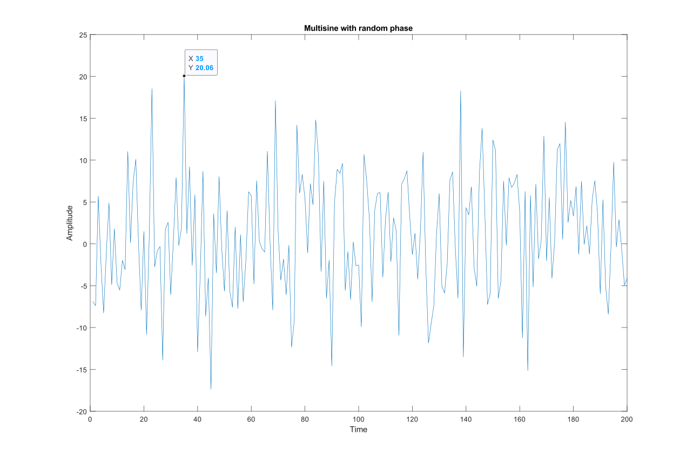

Azonos fázis esetén sokkal szabályosabb jelet kapunk.
A legnagyobb érték ebben az esetben $22.32$, de negatív irányban nagyobb, $-62.98$ méretű kilengés tapasztalható.
Az alábbi ábrán látható a 0 fázisú multiszinusz.

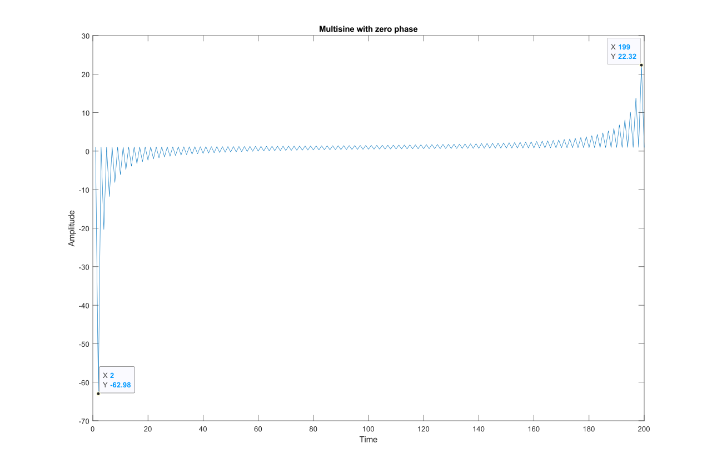

### 1.2
Az analizátor is egy külön matlab függvényként készült el `est_msin()`, hiszen többször fel kell majd használni a megoldás során. A függvény kimenete a jel komponenseinek becsült értéke, és az ezekből rekonstruált időfüggvény.

Alább látható ábrázolva az analizátor és az eredeti jel különbségének abszolút értéke. Látható, hogy egy teljes periódusnyi jel feldolgozása után a hiba nullára csökken, ami megfelelő működésnek titulálható.

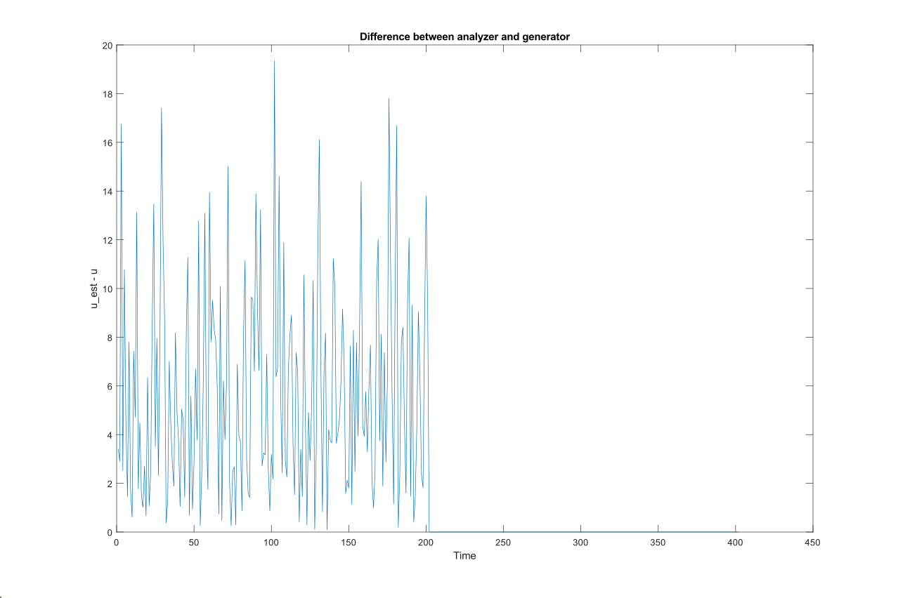

### 1.3
Ebben a feladatrészben először elkészítettem a modellezendő rendszer matlab példányát a `tf()` függvény felhasználásával, majd ráadtam az 1.1-es pontban elkészített random fázisú multiszinusz jelet.

Az alábbi ábrákon látható a rendszer és az analizátor kimenete. Ránézésre is egyértelmű, hogy a két jel között minimális az eltérés, ezért kijelenthető, hogy az analizátor alkalmas a rendszer adaptálására.

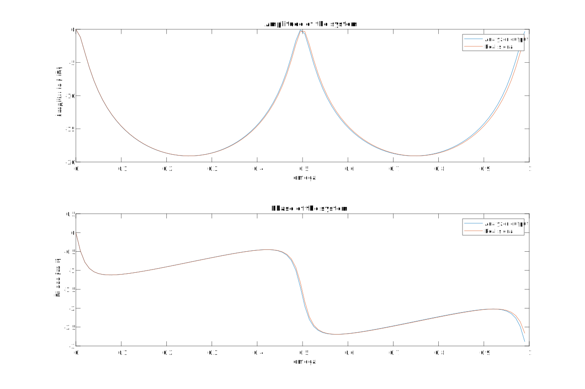

A következő ábrán pedig a rendszer kimenetének spektruma látható.

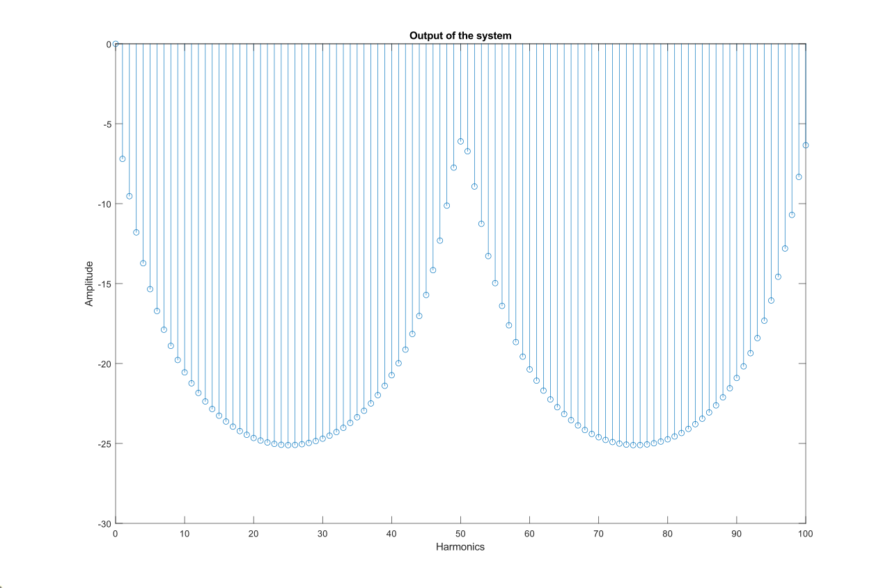

### 1.4
Ebben a feladatrészben a `ls_est_recursive()` függvényt használtam fel a rekurzív LS becslés végrhajtására.

A kimenő jel kb. 65 minta után tűnt állandónak, azonban a becslést egy teljes periódus után indítottam, mivel ekkor már biztosan elérte a rendszer az állandósult állapotát. Kisérletezéseim során arra jutottam, hogy a modellillesztési eljárás nagyjából 50 minta után már felvett egy állandó értéket. Nagyobb pontosság reményében itt is egy teljes periódusig futtattam az algoritmust.

### 1.5
A mértani sorba fejtést az átviteli függvény impulzusválaszának kiszámításával végeztem el.

Az alábbi képen látható a sorfejtés és a lineáris kombinátor együtthatóinak összehasonlítása. Megintcsak megfigyelhető a minimális különbség ami a becslés helyességéről tesz tanubizonyságot.

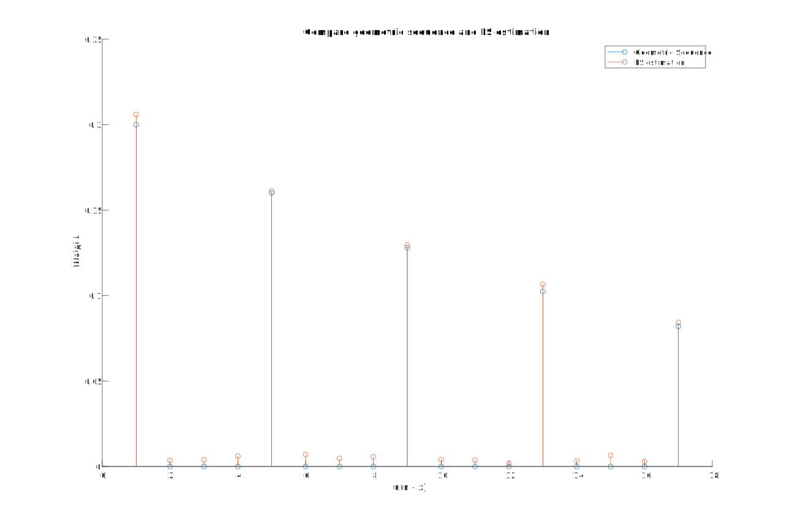

## 2. Feladat
Az LMS eljárás végrehajtására a `lms_est_recursive()` függvényt írtam meg. A bátorsági tényezőt a konvergencia kritérium századának választottam némi kisérletezés után. Ezzel az értékkel viszonylag gyors volt a konvergencia, de nem tapasztaltam oszcillációt.

A kísérlet során nyomon követtem az 5 legnagyobb abszolútértékű paraméter alakulását. Ezeket az alábbi konvergencia diagramon lehet látni. Látható, hogy az értékek minden esetben konvergálnak egy végértékhez. A paraméter megváltoztatása után a rendszer újra elkezd adaptálódni, de hasonló idő után megintcsak konstanshoz lesz hasonló a kimenet.

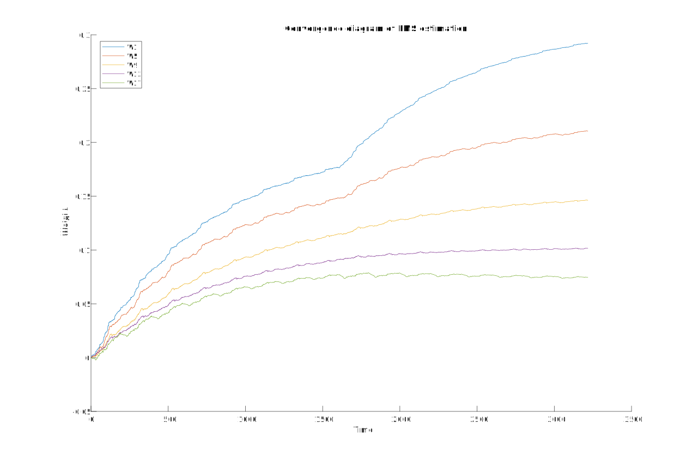

## 3. Feladat
A feladat során a `iir_est_recursive()` függvényt használtam fel. A modellillesztés során összesen 7 paraméter "történetét" kell nyomon követni. A regressziós vektorban szerepelnek az előző lépések bemenetei és kimenetei is.

Az alábbi ábrán látható a folyamat konvergencia diagramja. Látható, hogy az r <- r-q változtatás az $a_1$ és $b_4$ paraméterek esetében mutatkozik. Ezek esetében a végérték is megváltozik, míg a többi paraméter ugyanarra az értékre áll be némi tranziens jelenség után. Ennek oka, hogy az $a_1$ paraméter a rendszer felépítése miatt megegyezik a 1-r értékével. Hasonló állítást mondhatunk ki $b_4$-ről is, ennek végértéke -r értékével egyenlő. Ez akkor is igaz lesz ha r helyére r-q -t helyettesítünk, ezért változik értékük.

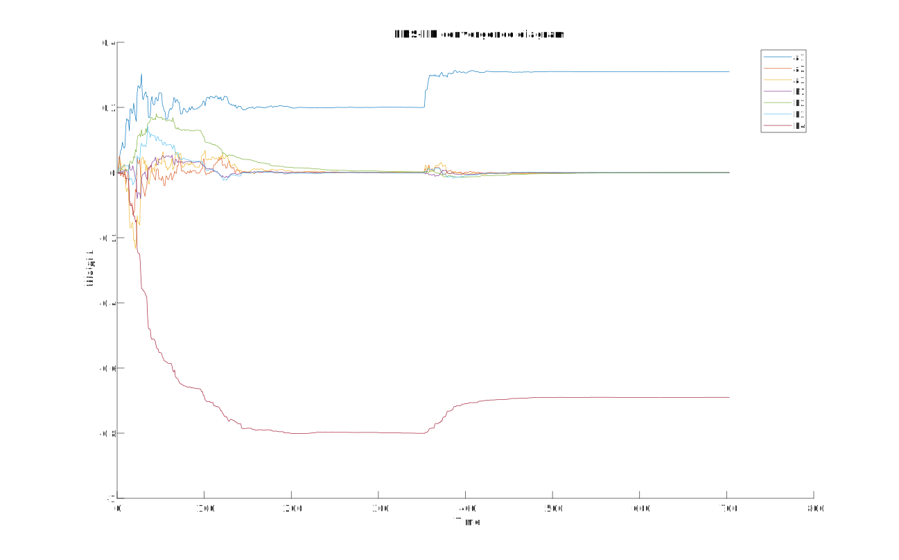

## 4. Feladat
Ebben a feladatban a `kalman_predictor()` függvény kerül felhasználásra. A függvényben először a matlab beépített eszközével `tf2ss()`, elkészítettem az állapotváltozós leírást az átviteli függvény felhasználásával.

Az alábbi ábrán P mátrix nyomát lehet végigkövetni az algoritmus futása alatt. Látható, hogy viszonylag gyorsan konvergál nullához, azonban a r megváltoztatása után, a kezdeti tranzienshez hasonló tüske keletkezik.

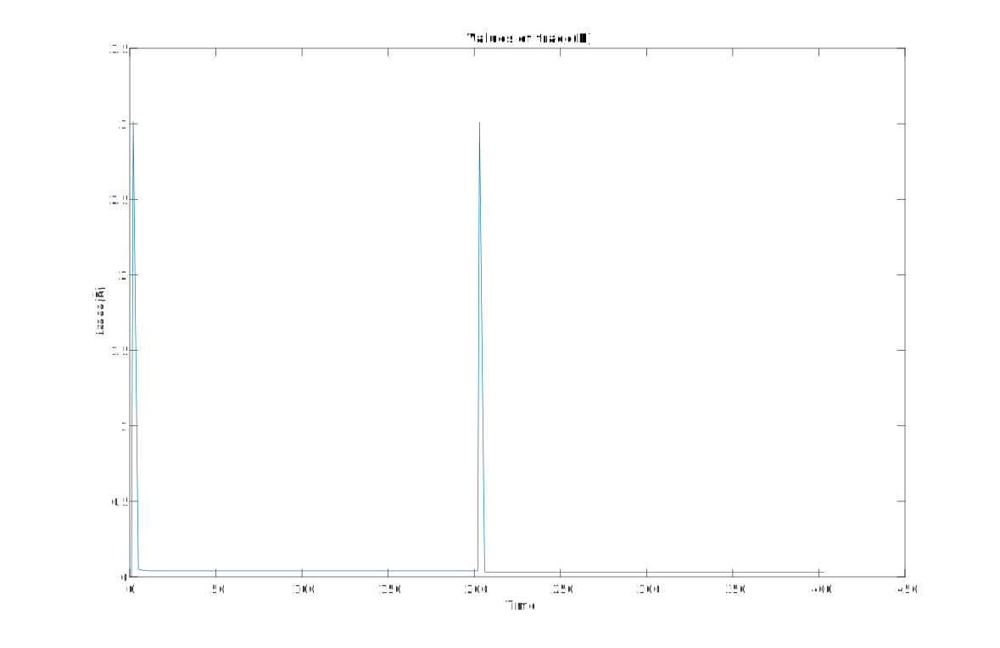

A következő képen az állapotváltozókat lehet végigköveteni. Ez önmagában nem tartalmaz sok információt, de ha belenagyítunk egy részébe, akkor jól láthatók az állapotváltozókat késleltető vonalak hatásai. Egy iterációban csak egy állapotváltozó változik, ami megfelel a vártaknak.

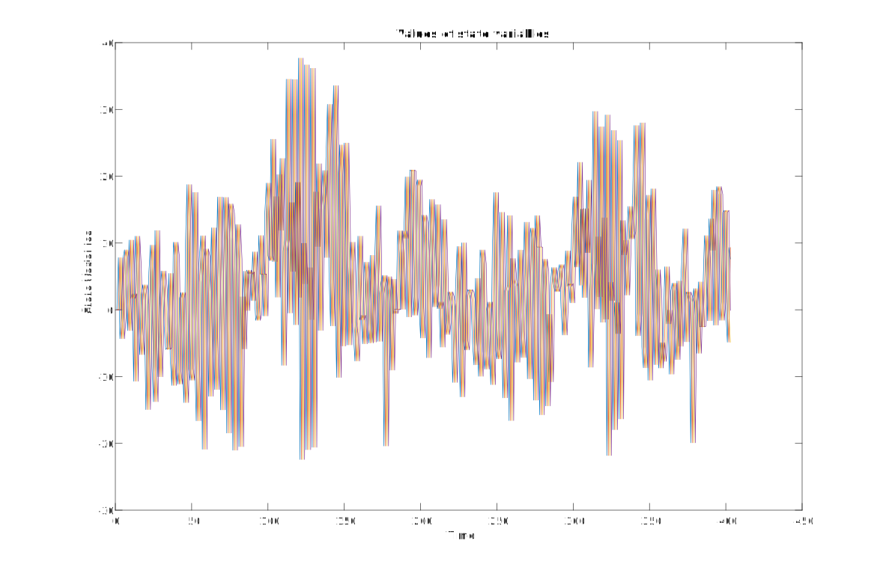
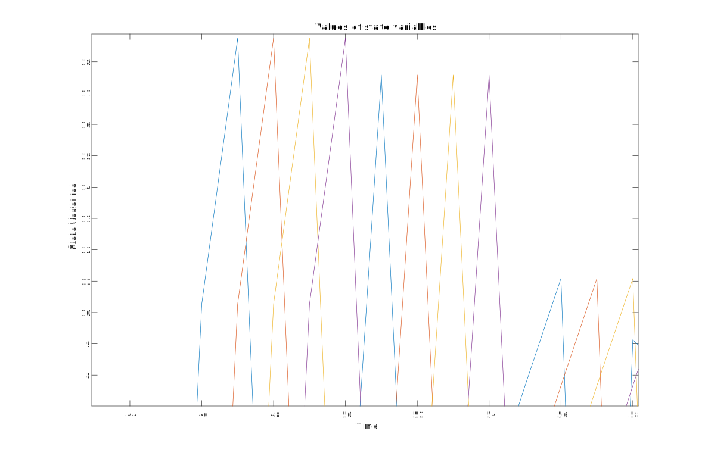

## MATLAB forráskód
Alább egyben feltüntetve szerepel a megoldás során használt matlab szkript teljes egészében

```m
clear variables
close all

%% Constant parameters
system_char = 'B';
r = 0.80;
q = 0.11;
p = 17;

M = 100;
N = 2*M + 1;

%% 1.1 Generating multisine
l = N - 1;
[u.zero, c.zero, g.zero, x.zero] = gen_msin(M, N, l, 'zero');
[u.rand, c.rand, g.rand, x.rand] = gen_msin(M, N, l, 'random');

% Plotting multisine functions
figure();
plot(u.zero);
title('Multisine with zero phase');
xlabel('Time');
ylabel('Amplitude');

figure();
plot(u.rand);
title('Multisine with random phase');
xlabel('Time');
ylabel('Amplitude');

%% 1.2 Multisine analyzer
% Using random phase
l = 2*N;
[u, c, g, x] = gen_msin(M, N, l, 'random');

[x_est, u_est] = est_msin(u, c, g, N, l);

% Plot difference of real and estimated signal
figure();
plot(abs(u_est - u));
title('Difference between analyzer and generator');
xlabel('Time');
ylabel('u\_est - u');

%% 1.3

% Cunstructing system as a tf object
num = [0, (1 - r)];
den = [1, 0, 0, 0, -r];
system = tf(num, den, 1, 'Variable', 'z^-1');

[h, w] = freqz(num, den, 101);

[u, c, g, x] = gen_msin(M, N, l, 'random');

y = lsim(system, u);

x_est = est_msin(y, c, g, N, l);

A     = 20 * log10(abs(x_est ./ x));
A_ref = 20 * log10(abs(h));

% Second part is mirrored, can be cut
A = A(1:M+1);
A_ref = A_ref(1:M+1);

fi     = angle(x_est ./ x);
fi_ref = angle(h);

% Second part is mirrored, can be cut
fi = fi(1:M+1);
fi_ref = fi_ref(1:M+1);

% Plotting amplitude and phase of real signal
figure();

subplot(2, 1, 1);
plot(w/pi, A, w/pi, A_ref);
title('Amplitude of the system');
xlabel('omega');
ylabel('Amplitude [dB]')
legend('Analyzer output', 'Real signal');

subplot(2, 1, 2);
plot(w/pi, fi, w/pi, fi_ref);
title('Phase of the system');
xlabel('omega');
ylabel('Phase [rad]')
legend('Analyzer output', 'Real signal');

% Plotting spectrum of the system output signal
output = 20*log10(abs(x_est));
output = output(1:M+1);
figure();
stem(0:M, output);
title('Output of the system');
xlabel('Harmonics');
ylabel('Amplitude');

%% 1.4
u = gen_msin(M, N, 2*N, 'random');
y = lsim(system, u);

W = ls_est_recursive(u, y, N, N, p);

%% 1.5

[W_ref, t] = geometric_sequence(system, p);

% Plot geometric sequence against estimation
figure();
hold on;
stem(t, W_ref);
stem(t, W);
hold off;
title('Compare geometric sequence and LS estimation');
xlabel('u(n - x)');
ylabel('Weight');
legend('Geometric Sequence', 'LS estimation');

%% 2
l = 8*N;
start = 200;
u = gen_msin(M, N, start + l, 'random');
y = lsim(system, u);

W = zeros(p, 1);
W_iters = zeros(p, 1);

[W_final, W_iters] = lms_est_recursive(u, y, W, W_iters, p, start, l-1);

% Changing the system
num_mod = [0, (1 - (r - q))];
den_mod = [1, 0, 0, 0, -(r - q)];
system_mod = tf(num_mod, den_mod, 1, 'Variable', 'z^-1');
y_mod = lsim(system_mod, u);

% Continuing the lms estimation with new system
[W_final, W_iters] = lms_est_recursive(u, y_mod, W_final, W_iters, p, start, l-1);

% Convergence diagram
iter_plot_values = [1, 5, 9, 13, 17];
legend_text = cell(length(iter_plot_values), 1);

figure();
hold on;
for k = 1:length(iter_plot_values)
    plot(W_iters(iter_plot_values(k), :));
    legend_text{k} = sprintf('W%i', iter_plot_values(k));
end
hold off;
legend(legend_text);
xlabel('Time');
ylabel('Weight');
title('Convergence diagram of LMS estimation');

%% 3
l = 8*N;
start = 100;
steps = 350;

% Input signal
u = gen_msin(M, N, l, 'random');

% System output
y = lsim(system, u);

% Starting values of estimation vector
W = zeros(7, 1);
W_iters = zeros(7, 1);

% Running LMS-IIR
[W_final, W_iters] = iir_est_recursive(u, y, W, W_iters, start, steps);

% Changing the system
num_mod = [0, (1 - (r - q))];
den_mod = [1, 0, 0, 0, -(r - q)];
system_mod = tf(num_mod, den_mod, 1, 'Variable', 'z^-1');
y_mod = lsim(system_mod, u);

% Running LMS-IIR on the modified system
[~, W_iters] = iir_est_recursive(u, y_mod, W_final, W_iters, start, steps);

% Plotting convergence diagram

figure(12);
hold on;
plot(W_iters(1,:));
plot(W_iters(2,:));
plot(W_iters(3,:));
plot(W_iters(4,:));
plot(W_iters(5,:));
plot(W_iters(6,:));
plot(W_iters(7,:));
hold off
title('LMS-IIR convergence diagram');
ylabel('Weight');
xlabel('Time');
legend('a1', 'a2', 'a3', 'b1', 'b2', 'b3', 'b4');

%% 4

% Input signal
u = gen_msin(M, N, l, 'random');

% Noise parameters
sigma_n = 0.02;
sigma_w = 0.05;

% Running Kalman prediction
[tp_iters, x_iters, x_est] = kalman_predictor(num, den, u, sigma_n,...
    sigma_w, N, 0, zeros(4, 1), zeros(4, 1));

% Prediction with modified system
[tp_iters, x_iters, x_est] = kalman_predictor(num_mod, den_mod, u, sigma_n,...
    sigma_w, N, tp_iters, x_iters, x_est);

% Plot values of trace(P)
figure();
plot(tp_iters);
title('Values of trace(P)');
xlabel('Time');
ylabel('trace(P)');

% Plot state variables
figure();
plot(x_iters');
title('Values of state variables');
xlabel('Time');
ylabel('State Variables');


%% FUNCTIONS %%

function [u, c, g, x] = gen_msin(M, N, length, phase)

    % Generating C and G vectors
    c = zeros(length, N);
    g = zeros(length, N);
    for m = 0 : N-1
        for n = 0 : length-1
            c(n + 1, m + 1) = exp(1j * 2 * pi / N * m * n);
            g(n + 1, m + 1) = conj(c(n + 1, m + 1)) / N;
        end
    end

    % Generating phase vector
    if(strcmp(phase, 'random'))
        fi = rand(1, N) * 2 * pi;
    else
        fi = zeros(1, N);
        % Zero phase becomes pi/2 so we have sin and not cos
        fi = fi + (pi/2);
    end

    % Generating x vector
    x = ones(N, 1);
    for k = 0 : M
        x(k + 1) = 0.5 * exp(1j * fi(k + 1));
        x(N - (k) + 1) = conj(x(k + 1));
    end
    x(1) = 1;
    x = x(1 : N);

    % Generating multisine, any imaginary component is rounding error.
    u = real(c * x);
end

function [x_estimated, u_estimated] = est_msin(u, c, g, N, steps)

    x_estimated = zeros(N, 1);
    u_estimated = zeros(steps, 1);

    % Analyzing recursively
    for index = 0 : steps - 1
        u_estimated(index + 1) = c(mod(index, N) + 1, :) * x_estimated;
        x_estimated            = x_estimated + (g(mod(index, N) + 1,:) .* ...
                                 (u(index + 1) - u_estimated(index + 1))).';
    end
    
    u_estimated = real(u_estimated);
end

function [W, W_iters] = ls_est_recursive(u, y, start, steps, p)
    W       = zeros(p, 1);
    W_iters = zeros(p, steps);
    U       = flip(u(1:p)');
    P       = inv(U'*U);

    % Recursive LS estimation
    for k = start: start + steps
        U = flip(u(k - p : k - 1)');
        G = (P * U') / (1 + U * P * U');
        P = (eye(size(P)) - (G * U)) * P;
        W = W + G * (y(k) - U * W);
        W_iters = [W_iters, W];
    end
    
end

function [W, t] = geometric_sequence(system, p)
    [W, t] = impulse(system, 1 : p);
end

function [W_final, W_iters_final] = lms_est_recursive(x, y, W, W_iters, p, start, steps)

    for k = start : start + steps
        X = flip(x(k-p : k-1));
        R = X * X';
        mu = 1 / (max(eig(R)) * 100);
        error = y(k) - (X' * W);
        W = W + (2 * mu * X * error);
        W_iters = [W_iters, W];
    end
    
    W_final = W;
    W_iters_final = W_iters;
end

function [W_final, W_iters_final] = iir_est_recursive(x, y, W, W_iters, start, steps)
    
    % LMS-IIR algorithm
    for k = start : start + steps
        X = [flip(x(k-3 : k-1)); flip(-1 * y(k-4 : k-1))];
        R = X * X';
        mu = 1 / (max(eig(R)) * 4);
        e = y(k) - (X' * W);
        W = W + (2 * mu * X * e);
        W_iters = [W_iters W];
    end
    
    % Setting output parameters
    W_final = W;
    W_iters_final = W_iters;
end

function [tp_iters, x_iters, x_est] = kalman_predictor( ...
    num, den, u, sigma_n, sigma_w, steps, tp_iters, x_iters, x_est)

    % Create State Space model from transfer function
    [A, B, C, D] = tf2ss(num, den);
    
    % Init state variables
    x = x_est;
    
    % Create noise
    n = normrnd(0, sigma_n, [steps, 1]);
    w = normrnd(0, sigma_w, [4, steps]);
    
    % Kalman predictor matrices
    R = sigma_n^2;
    Q = sigma_w^2 * eye(4);
    P = eye(4);
    
    % Running Kalman predictor
    for k = 1 : steps
          
        % Simulate
        x = (A * x) + (B * u(k)) + w(:,k);
        y(k+1) = (C * x) + n(k);
        
        % Predict
        y_est(k) = C * x_est;
        e = y(k) - y_est(k);
        G = (A * P * C') * inv((C * P * C') + R);
        P = (A - G * C) * P * A.' + Q;
        x_est = (A * x_est) + (B * u(k)) + (G * e);
        
        % iterations of error
        tp_iters = [tp_iters; trace(P)];
        
        % Iterations of state variables
        x_iters = [x_iters x_est];
    end

end


```
